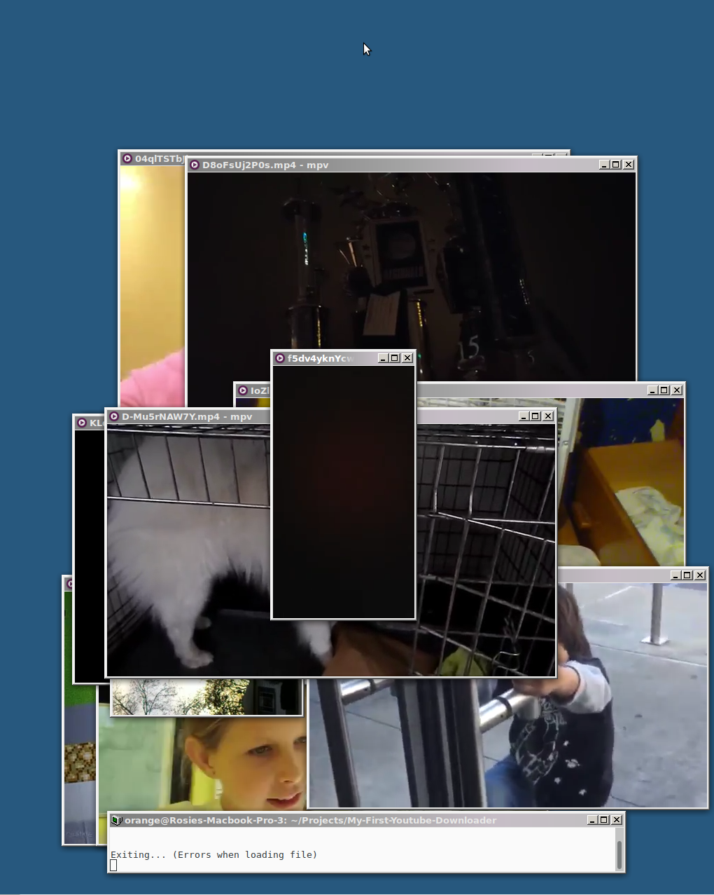

# My First Youtube Downloader

Hey guys, its orange here with another cool script
this time you need :
* Youtube-dl
* Lynx (the browser not the spray lol)
* mpv

These can be found in the Debian repos and most other repos too!
I assume you can get them in brew as well (you can grab youtube-dl from pip)

# But what does it __do__?
The script downloads a list of all videos on the first page of the search for youtube videos with "first vlog" in the title that were uploaded in the last hour. They are played automatically and as new ones are uploaded they will be downloaded and played automatically too! The script does automatically delete videos that are not on the first page so you wont use up all of your precious storage up.

Anyway thats it for today, thanks for reading / checking out my repo, send me an email with suggestions of what do next, like, comment, share and follow me
